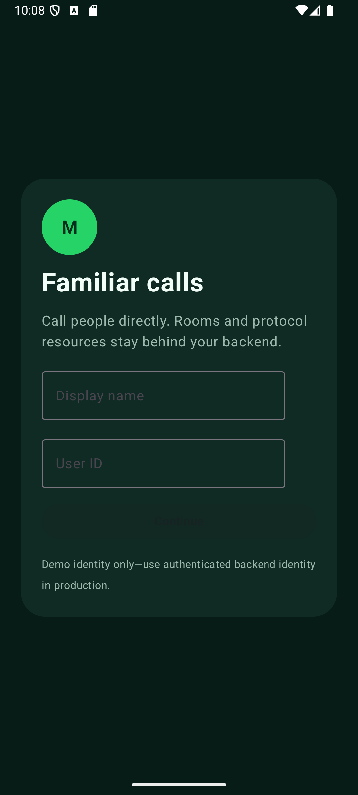

# WhatsApp-style Android calls with WHIP + WHEP

This is a native Kotlin/Jetpack Compose two-person calling example built
**without a MediaSFU client SDK**. People call people: the UI never asks for or
displays a room ID. Android captures local camera/microphone media, publishes it
with WHIP, and plays the other person's media with WHEP.

The app deliberately shares the repository backend with the browser and SDK
examples. That backend creates the invisible room and returns only short-lived,
participant-scoped WHIP/WHEP leases. MediaSFU account credentials never belong
in the APK.

## Included call experience

- Contact-first identity, outgoing call, incoming accept/decline, audio/video calls.
- Remote video is primary and local camera is a bounded draggable mini preview.
- Double-tap swaps remote and local video.
- Native Android screen sharing requests MediaProjection consent, keeps capture
  in the required foreground service, republishes the screen through WHIP, and
  restores camera publication when sharing stops. Screen remains primary and
  swapping is disabled while it is active.
- Remote audio is enabled independently from video rendering through WebRTC's
  Android audio device path.
- Microphone, camera, and end-call controls.
- Complete ICE gathering before each SDP POST.
- WHEP RTP payload-type alignment using MediaSFU's response profile.
- Direct HTTP `DELETE` for WHEP and WHIP resources, followed by backend call end
  and room cleanup.

## Architecture and trust boundary

```text
Android app                    Shared example backend               MediaSFU
    |-- call/accept over HTTP -------->|-- create hidden room ---------->|
    |-- prepare publisher ------------>|-- create external session ---->|
    |<-- scoped WHIP lease ------------|                                |
    |================ WHIP SDP + media ================================>|
    |-- poll peer media -------------->|-- create playback ------------>|
    |<-- scoped WHEP lease -------------|                               |
    |<=============== WHEP SDP + peer media ============================|
    |-- DELETE WHEP/WHIP resources ------------------------------------>|
    |-- end call ---------------------->|-- final cleanup -------------->|
```

The Android app depends on `io.github.webrtc-sdk:android`; it does **not**
depend on `mediasfu-sdk-kotlin`, `mediasfu-shared`, or another MediaSFU client
SDK. Protocol code lives in `WhipWhepClient.kt`, backend HTTP calls in
`BackendApi.kt`, SDP/presentation math in focused files, and Compose owns only
product UI and video surfaces.

The demo identity fields are not authentication. In production, derive the
caller from your authenticated server session, authorize the callee, restrict
CORS, rate-limit calls, and keep protocol leases short-lived.

## Run on an Android emulator

Requirements: JDK 17, Android SDK 35, an API 26+ emulator, Node.js 20+, and
either MediaSFU Cloud credentials or a compatible MediaSFU Open deployment.
Never put account credentials in Gradle properties, Kotlin source, the APK, or
screenshots.

1. Configure and start the shared backend from `server/README.md`. The default
   backend port is `8790`.
2. Build this app using any Gradle 8.9 wrapper (the Kotlin SDK wrapper already
   present in this workspace is convenient during source development):

   ```powershell
   $env:JAVA_HOME = 'C:\Program Files\Java\jdk-17'
   ..\..\..\mediasfu-sdk-kotlin\gradlew.bat -p . :app:testDebugUnitTest :app:lintDebug :app:assembleDebug
   ```

3. Start an emulator and install `app/build/outputs/apk/debug/app-debug.apk`.
   The debug build reaches the host backend at `http://10.0.2.2:8790`.
4. Use a second emulator or the browser WHIP/WHEP app as the other person.
   Create two distinct demo identities, call the second user ID, then accept.

To select another **development** backend without editing source:

```powershell
..\..\..\mediasfu-sdk-kotlin\gradlew.bat -p . :app:assembleDebug `
  -PcallBackendBaseUrl=http://10.0.2.2:8890
```

Release builds disallow cleartext traffic. Use HTTPS in production.

## MediaSFU Cloud and MediaSFU Open

- **MediaSFU Cloud** is the managed service. Start with the
  [MediaSFU documentation](https://mediasfu.com/docs/), obtain API details from
  the [Developer Console guide](https://mediasfu.com/documentation/), and try
  room HTTP requests in the [Sandbox](https://mediasfu.com/sandbox).
- **MediaSFU Open** is a media server **you install and run on your own
  infrastructure**. A URL alone does not install or operate it. Your deployment
  must expose compatible room, external-session, WHIP, playback, and WHEP
  endpoints. See [MediaSFU Open](https://github.com/MediaSFU/MediaSFUOpen).

The room API and external-media API must point to the same environment. Do not
mix a staging room with production WHIP/WHEP endpoints.

## Validation status

Verified locally on Windows with JDK 17:

- `:app:testDebugUnitTest` — passed (payload remapping and mini bounds).
- `:app:lintDebug` — passed.
- `:app:assembleDebug` — passed; debug APK produced.
- APK installation — passed on `Medium_Phone_API_36`; the launcher activity ran
  as the foreground activity.
- Real native/browser staging call — passed. One Android call created exactly
  one room, both participants reached Live, and browser metrics decoded the
  Android camera at 960×540 (`readyState` 4 and playing).
- Native MediaProjection — passed. Consent, the required foreground service,
  remote screen publication, Stop, camera restoration, and zero-active-call
  cleanup were observed.
- Android remote-main/local-mini surfaces — observed in the live call. Android
  `SurfaceViewRenderer` pixels are black in ordinary emulator screenshots, so
  browser decode metrics are the pixel-level production proof.



See `test-evidence/kotlin-android-whip-whep/staging/manifest.md` for the redacted
acceptance record. Audible remote audio and runtime execution of the final
native drag/double-tap listener are not claimed by this run. Do not label a
UI-only preview or successful SDP response as media proof.

## Screen capture lifecycle

The app requests Android MediaProjection consent, starts a media-projection
foreground service, publishes the display track through the same WHIP session
flow, keeps screen share primary, and restores camera publication when sharing
stops. The platform-owned foreground-service code remains separate from the
protocol and presentation resolver so the signaling layer stays reusable.
