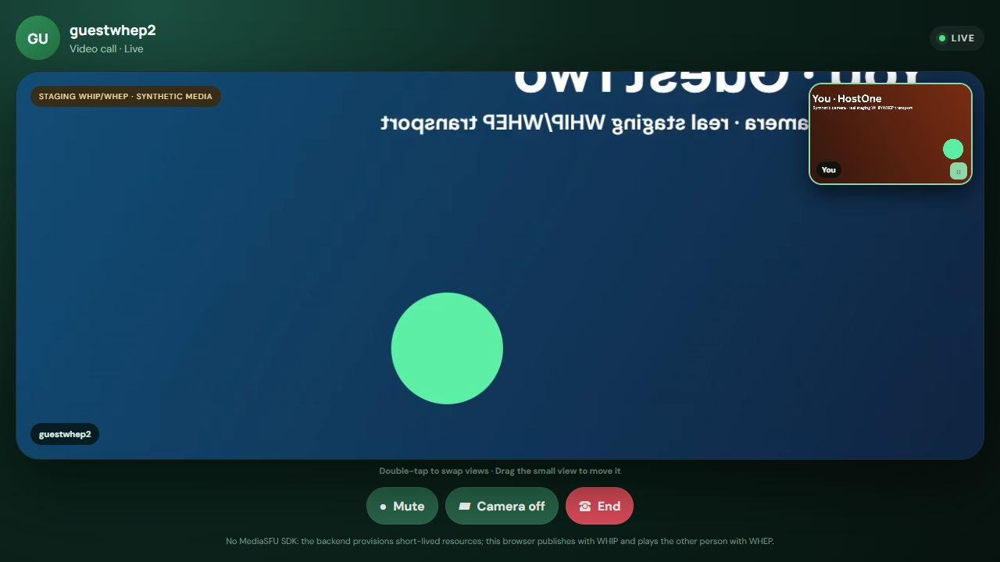
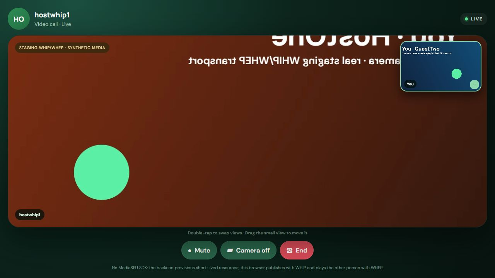
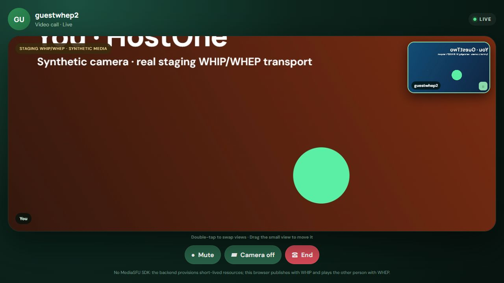
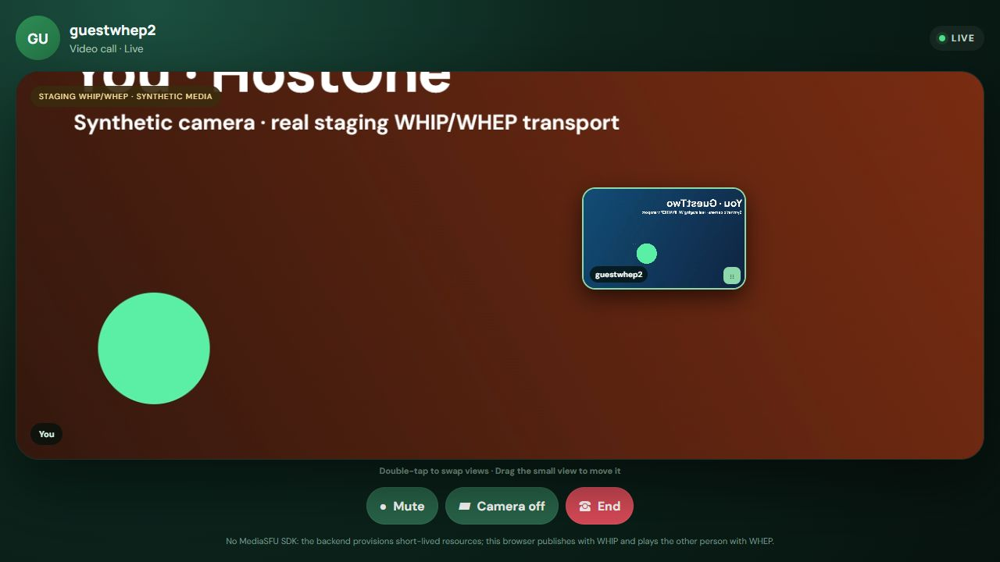

# WhatsApp-style calls with WHIP + WHEP

This is a two-person browser calling example built without a MediaSFU client
SDK. The product experience is contact-first: choose an identity, call another
user, accept or decline, and enter the call. Users never type, copy, or see a
room ID.

During a video call, remote media is the main surface and self-view is a bounded,
draggable mini preview. Double-click or double-tap either surface to swap them.
The same screen includes microphone, camera, and end-call controls.

> The identity form is a small demo substitute for sign-in. Replace it with
> authenticated users and server-side authorization before production.

## What is—and is not—used

| Layer | This example uses | This example does not use |
| --- | --- | --- |
| Product signaling | HTTP create, accept, poll, and end requests | A room create/join screen |
| Media publishing | Browser WebRTC offer sent to a WHIP resource | A MediaSFU client SDK |
| Media playback | Browser WebRTC offer sent to a WHEP resource | SDK media renderers |
| Incoming-call updates | HTTP polling | A Socket.IO client or control socket |
| Privileged credentials | The shared backend only | API credentials in browser code |

The repository's shared backend still supports Socket.IO for sibling SDK
examples. This frontend does not import it, connect to it, or depend on it.

## End-to-end flow

```text
Caller browser                        Shared backend                    MediaSFU
      |                                     |                              |
      |-- HTTP: call a user --------------->|-- HTTP: create room -------->|
      |<------------- ringing session ------|                              |
      |                                     |                              |
Callee polls, sees the call, and accepts    |                              |
      |-- HTTP: accept --------------------->|                              |
      |                                     |                              |
Each browser                                |                              |
      |-- HTTP: prepare publisher --------->|-- create external session -->|
      |<--------- short-lived WHIP lease ---|                              |
      |================ WHIP publish =====================================>|
      |                                     |                              |
      |-- HTTP: poll for peer media ------->|-- inspect source/create ---->|
      |<--------- short-lived WHEP lease ---|       WHEP playback           |
      |<=============== WHEP playback =====================================|
      |                                     |                              |
      |-- HTTP: end call ------------------>|-- DELETE playback ---------->|
      |                                     |-- DELETE publisher --------->|
      |                                     |-- DELETE room -------------->|
```

The caller's external publisher is admitted as the room host; the invited
person is admitted as the second participant. Both publish their own audio
(and video for video calls) through WHIP. Each browser consumes the other
person's source through a separate WHEP playback.

Before sending the WHEP offer, the browser reads MediaSFU's RTP payload profile
and aligns dynamic payload types in its SDP. Cleanup happens in dependency
order: WHEP playbacks, WHIP publishers, then the temporary room.

The frontend's complete app-backend surface is deliberately small:

| Request | Purpose |
| --- | --- |
| `POST /api/protocol/calls/create` | Create the invisible room and ringing session |
| `GET /api/users/:userId/sessions` | Poll invitations and call state |
| `POST /api/protocol/calls/accept` | Accept without creating an SDK participant |
| `POST /api/protocol/prepare` | Provision this user's WHIP publisher |
| `GET /api/protocol/sessions/:sessionId/peer` | Provision WHEP playback and poll optional peer presentation state |
| `POST /api/protocol/sessions/:sessionId/presentation` | Publish this participant's ephemeral screen-share state |
| `POST /api/sessions/:sessionId/end` | End and clean up the call |

## Security boundary

Only the backend reads `MEDIASFU_API_USERNAME` and `MEDIASFU_API_KEY`. The
browser receives a scoped, short-lived WHIP or WHEP bearer token only when it
needs that resource. The example keeps those leases in memory; it does not put
them in URLs, local storage, screenshots, or the JSON call-session store.

The shipped user IDs are not authentication. A production backend must derive
the caller's identity from its own authenticated session, authorize the target,
restrict CORS, rate limit the API, and use managed expiring storage for protocol
leases.

## Run locally

Requirements: Node.js 20 or newer, two browser contexts, and either MediaSFU
Cloud credentials or an already-running compatible MediaSFU Open deployment.

1. Start the repository's shared backend:

   ```powershell
   cd server
   npm install
   Copy-Item .env.example .env
   # Add your MediaSFU settings to this private, gitignored file.
   npm test
   npm start
   ```

2. Start this frontend:

   ```powershell
   cd apps\whip-whep
   npm install
   npm test
   npm run dev
   ```

3. Open `http://127.0.0.1:4178` in two separate browser contexts. Create two
   different demo identities, enter the other person's user ID, and call.

The backend listens on `8790`, and Vite proxies `/api` to it. This example does
not occupy port `3001`, which is reserved for the main MediaSFU frontend in this
workspace.

### Backend configuration

| Variable | Purpose | Cloud default |
| --- | --- | --- |
| `MEDIASFU_API_USERNAME` | Server-held API username | Required |
| `MEDIASFU_API_KEY` | Server-held API key | Required |
| `MEDIASFU_ROOM_API_URL` | HTTP room create/delete endpoint | `https://mediasfu.com/v1/rooms/` |
| `MEDIASFU_EXTERNAL_MEDIA_API_URL` | External-session and playback API origin | `https://mediasfu.com` |

The room and external-media URLs must select the same environment. Do not
create a staging room and request its WHIP/WHEP resources from production, or
vice versa.

For an authorized staging run, keep staging values in a private file outside
the repository and point `MEDIASFU_VALIDATION_ENV_PATH` at it. Never copy that
file into source control or retained evidence.

### MediaSFU Cloud and MediaSFU Open

- **MediaSFU Cloud** is the managed service. Create or inspect API settings in
  the [Developer Console](https://mediasfu.com/documentation), test HTTP calls
  in the [Sandbox](https://mediasfu.com/sandbox), and start with the
  [MediaSFU documentation](https://mediasfu.com/docs/).
- **MediaSFU Open** means a MediaSFU media server that **you install and run** on
  your own infrastructure. Pointing these variables at a URL does not install,
  start, or configure that server. Your deployment must expose compatible room,
  external-session, WHIP, playback, and WHEP contracts. Start from the
  [MediaSFU Open repository](https://github.com/MediaSFU/MediaSFUOpen).

For the general production credential and room-API pattern, use the
[Developer Console Guide](https://mediasfu.com/documentation/).

## Validation and evidence

Automated checks cover SDP payload alignment, WHIP/WHEP resource handling,
error safety, and bounded mini-preview movement:

```powershell
cd apps\whip-whep
npm test
npm run build

cd ..\..\server
npm test
```

Automated tests and UI fixtures do not prove a real call. Real acceptance
requires two independent browsers in one temporary staging room, two active
WHIP publishers, reciprocal WHEP playback, decoded peer video in both
directions, active audio/video protocol resources, and successful end/cleanup.
Audible output still requires a human or audio-capture check.

The retained staging evidence uses these stable, credential-free paths:









The evidence manifest must distinguish synthetic capture from synthetic UI.
A development-only canvas/microphone stream can be genuine WebRTC input sent
through real staging WHIP and returned through real WHEP; a static mock or UI
preview cannot fill a protocol acceptance row.

## Production checklist

- Replace demo identity fields with authenticated, authorized users.
- Serve the frontend and backend over HTTPS; restrict CORS and trusted origins.
- Add rate limits, abuse controls, observability, expiry, and managed storage.
- Keep account credentials on the backend and protocol leases short-lived.
- Confirm the selected environment enables external WHIP ingest and WHEP egress.
- Exercise camera/microphone denial, token expiry, refresh, disconnect, end,
  duplicate cleanup, and room expiry.
- Validate two real people publishing and consuming audio/video on every target
  browser and device class.
- Do not claim ICE restart or automatic session recovery: this focused example
  starts a fresh call after a failed protocol resource.
